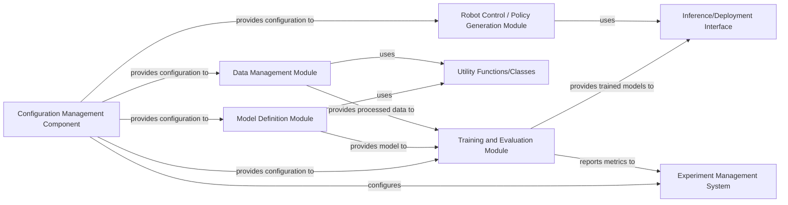

## Details

One paragraph explaining the functionality which is represented by this graph. What the main flow is and what is its purpose.

### Configuration Management Component [[Expand]](./Configuration_Management_Component.md)
Centralizes and manages all configurable parameters, including model hyperparameters, dataset paths, training settings, and evaluation configurations. It ensures reproducibility of experiments and facilitates easy modification of experimental settings without altering core logic.

**Related Classes/Methods**:

- `open_clip.factory`
- <a href="https://github.com/clip-rt/clip-rt/blob/main/libero/run_libero_eval_clip_rt.py" target="_blank" rel="noopener noreferrer">`libero.run_libero_eval_clip_rt`</a>

### Model Definition Module
Encapsulates the neural network architectures and core model logic, including specific implementations like the CLIP model. It defines how models are constructed and their forward pass operations.

**Related Classes/Methods**:

- `open_clip.factory`

### Data Management Module
Responsible for handling all aspects of data, including loading datasets, performing necessary preprocessing (e.g., normalization, resizing), data augmentation, and managing dataset versions.

**Related Classes/Methods**: _None_

### Training and Evaluation Module
Orchestrates the entire machine learning pipeline, including training loops, model validation, testing, and performance evaluation. It manages the training process, checkpointing, and metric logging.

**Related Classes/Methods**:

- <a href="https://github.com/clip-rt/clip-rt/blob/main/libero/run_libero_eval_clip_rt.py" target="_blank" rel="noopener noreferrer">`libero.run_libero_eval_clip_rt`</a>

### Inference/Deployment Interface
Provides a standardized interface for loading trained models and performing predictions. It abstracts the underlying model execution details, making it easy to integrate models into downstream applications.

**Related Classes/Methods**: _None_

### Experiment Management System
A system for tracking and logging all aspects of experiments, including hyperparameters, model checkpoints, training logs, and evaluation metrics, crucial for reproducibility and comparing experimental results.

**Related Classes/Methods**: _None_

### Utility Functions/Classes
A collection of common helper functions and classes that provide reusable functionalities across different modules, such as mathematical operations, file I/O, or general data manipulation.

**Related Classes/Methods**: _None_

### Robot Control / Policy Generation Module
Specific to the robotics domain, this module is responsible for generating robot policies and controlling robot actions based on the outputs of the trained models. It integrates with robotics frameworks and hardware.

**Related Classes/Methods**:

- <a href="https://github.com/clip-rt/clip-rt/blob/main/libero/run_libero_eval_clip_rt.py" target="_blank" rel="noopener noreferrer">`libero.run_libero_eval_clip_rt`</a>

### [FAQ](https://github.com/CodeBoarding/GeneratedOnBoardings/tree/main?tab=readme-ov-file#faq)