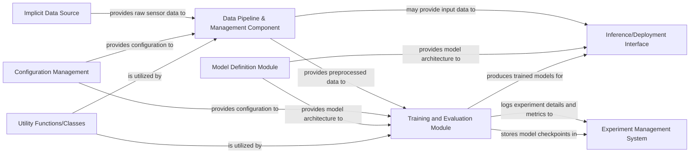

## Details

Abstract Components Overview

### Data Pipeline & Management Component [[Expand]](./Data_Pipeline_Management_Component.md)
Manages the entire data flow, from loading raw sensor data (e.g., from HDF5 files) and converting it, to applying necessary transformations (e.g., image resizing, normalization) and tokenization. This component ensures data is in the correct format and ready for model consumption, acting as the central module for preparing all input data.

**Related Classes/Methods**:

- `finetune.preprocess`
- `libero.preprocess`
- <a href="https://github.com/clip-rt/clip-rt/blob/main/libero/hdf5_to_raw.py" target="_blank" rel="noopener noreferrer">`libero.hdf5_to_raw`</a>

### Model Definition Module
Defines the neural network architectures and core model logic, including the CLIPModel and any other specialized models used in the project.

**Related Classes/Methods**:

- <a href="https://github.com/clip-rt/clip-rt/blob/main/open_clip/src/open_clip/model.py" target="_blank" rel="noopener noreferrer">`open_clip.src.open_clip.model`</a>

### Training and Evaluation Module
Orchestrates the training loops, validation, and testing procedures. It manages model optimization, loss calculation, and performance metric tracking, and produces trained models.

**Related Classes/Methods**:

- <a href="https://github.com/clip-rt/clip-rt/blob/main/libero/run_libero_eval_clip_rt.py" target="_blank" rel="noopener noreferrer">`libero.run_libero_eval_clip_rt`</a>

### Inference/Deployment Interface
Provides a clear interface for loading trained models and performing predictions. It handles the execution of models on new, unseen data.

**Related Classes/Methods**:

- <a href="https://github.com/clip-rt/clip-rt/blob/main/libero/run_libero_eval_clip_rt.py" target="_blank" rel="noopener noreferrer">`libero.run_libero_eval_clip_rt`</a>

### Configuration Management
Centralizes all hyperparameters, model paths, dataset paths, and other configurable parameters, ensuring consistent settings across different runs and experiments.

**Related Classes/Methods**: _None_

### Utility Functions/Classes
Contains common utility functions and classes that are reusable across different modules, such as general-purpose data manipulation, file I/O, or helper functions.

**Related Classes/Methods**:

- `libero.libero_utils`
- <a href="https://github.com/clip-rt/clip-rt/blob/main/libero/clip_rt_utils.py" target="_blank" rel="noopener noreferrer">`libero.clip_rt_utils`</a>
- <a href="https://github.com/clip-rt/clip-rt/blob/main/libero/robot_utils.py" target="_blank" rel="noopener noreferrer">`libero.robot_utils`</a>

### Experiment Management System
Implements a robust system for tracking experiments, including hyperparameters, model checkpoints, training logs, and evaluation metrics, facilitating reproducibility and analysis.

**Related Classes/Methods**: _None_

### Implicit Data Source
Represents an external source of raw sensor data for the project.

**Related Classes/Methods**: _None_

### [FAQ](https://github.com/CodeBoarding/GeneratedOnBoardings/tree/main?tab=readme-ov-file#faq)