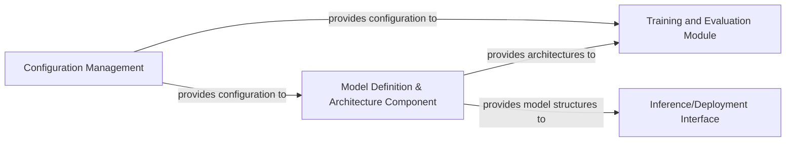

## Details

Overview of abstract components and their relationships in a machine learning project.

### Model Definition & Architecture Component [[Expand]](./Model_Definition_Architecture_Component.md)
This component is responsible for defining and encapsulating the core neural network architectures used within the project. It includes various CLIP and CoCa models, along with their fundamental building blocks such as vision and text transformers. Its primary role is to provide the structural blueprints for the machine learning models.

**Related Classes/Methods**:

- <a href="https://github.com/clip-rt/clip-rt/blob/main/open_clip/src/open_clip/model.py#L1-L1" target="_blank" rel="noopener noreferrer">`open_clip.src.open_clip.model` (1:1)</a>
- <a href="https://github.com/clip-rt/clip-rt/blob/main/open_clip/src/open_clip/coca_model.py#L1-L1" target="_blank" rel="noopener noreferrer">`open_clip.src.open_clip.coca_model` (1:1)</a>
- `open_clip.src.open_clip.factory`

### Training and Evaluation Module
This module orchestrates the training process of the defined models. It handles data loading, model optimization, loss calculation, and performance evaluation. It consumes model architectures from the Model Definition & Architecture Component and utilizes configurations from the Configuration Management component to guide the training and evaluation loops.

**Related Classes/Methods**: _None_

### Inference/Deployment Interface
This component provides the necessary interfaces and functionalities for loading trained models and performing predictions. It serves as the gateway for external applications or users to interact with the deployed models, ensuring efficient and scalable inference. It receives model structures from the Model Definition & Architecture Component and applies them for prediction tasks.

**Related Classes/Methods**: _None_

### Configuration Management
This component centralizes and manages all configurable parameters for the project, including model hyperparameters, training settings, dataset paths, and deployment options. It provides these configurations to other components, ensuring consistent and reproducible behavior across different stages of the machine learning pipeline.

**Related Classes/Methods**: _None_

### [FAQ](https://github.com/CodeBoarding/GeneratedOnBoardings/tree/main?tab=readme-ov-file#faq)