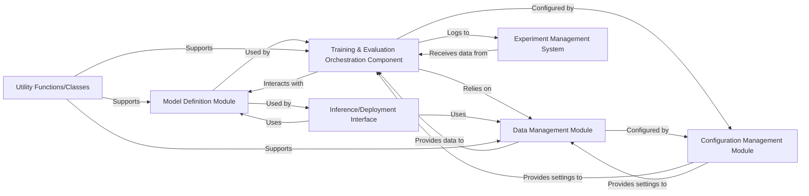

## Details

Architectural components for the `libero` project, focusing on a modular and data-driven design suitable for a Machine Learning Research Project.

### Model Definition Module
Defines the neural network architectures, including the core CLIP model and any associated components like the Robotics Transformer (RT) head. This module encapsulates the model's forward pass logic and parameter definitions.

**Related Classes/Methods**:

- `CLIPModel`

### Data Management Module
Handles data loading, preprocessing, augmentation, and dataset creation. It ensures that raw data is transformed into a format suitable for model training and evaluation, managing data pipelines efficiently.

**Related Classes/Methods**:

- `DataPreprocessor`

### Training & Evaluation Orchestration Component [[Expand]](./Training_Evaluation_Orchestration_Component.md)
Orchestrates the entire training loop, validation, and evaluation processes. It manages the flow of data through the model, applies loss calculations, updates model parameters using optimizers, and coordinates the overall training regimen.

**Related Classes/Methods**:

- <a href="https://github.com/clip-rt/clip-rt/blob/main/libero/run_libero_eval_clip_rt.py" target="_blank" rel="noopener noreferrer">`libero/run_libero_eval_clip_rt.py`</a>

### Configuration Management Module
Manages all configurable parameters for the project, including hyperparameters, model paths, dataset paths, and training settings. It provides a centralized mechanism for accessing and modifying these parameters, facilitating experiment setup and reproducibility.

**Related Classes/Methods**:

- `ConfigurationManager`

### Experiment Management System
Tracks experiment metadata, logs training progress (e.g., loss, accuracy), stores model checkpoints, and records evaluation metrics. This system is critical for monitoring experiments, comparing results, and ensuring reproducibility.

**Related Classes/Methods**:

- `ExperimentManager`

### Inference/Deployment Interface
Provides a clear interface for loading trained models and performing predictions. This module handles the necessary steps to take a trained model and apply it to new, unseen data, whether in a simulated environment or for real-world deployment.

**Related Classes/Methods**:

- `libero/inference.py`

### Utility Functions/Classes
Contains common helper functions and classes used across various modules. This includes mathematical operations, file I/O, general-purpose data manipulation, and other reusable code snippets that do not belong to a specific core component.

**Related Classes/Methods**:

- `libero/utils/utils.py`

### [FAQ](https://github.com/CodeBoarding/GeneratedOnBoardings/tree/main?tab=readme-ov-file#faq)