```mermaid
graph LR
    Configuration_Management_Component["Configuration Management Component"]
    Data_Pipeline_Management_Component["Data Pipeline & Management Component"]
    Model_Definition_Architecture_Component["Model Definition & Architecture Component"]
    Loss_Functions_Component["Loss Functions Component"]
    Training_Evaluation_Orchestration_Component["Training & Evaluation Orchestration Component"]
    Configuration_Management_Component -- "Configures" --> Model_Definition_Architecture_Component
    Configuration_Management_Component -- "Configures" --> Data_Pipeline_Management_Component
    Data_Pipeline_Management_Component -- "Provides data to" --> Training_Evaluation_Orchestration_Component
    Model_Definition_Architecture_Component -- "Produces output for" --> Loss_Functions_Component
    Model_Definition_Architecture_Component -- "Utilized by" --> Training_Evaluation_Orchestration_Component
    Loss_Functions_Component -- "Provides loss to" --> Training_Evaluation_Orchestration_Component
    Training_Evaluation_Orchestration_Component -- "Orchestrates" --> Model_Definition_Architecture_Component
    Training_Evaluation_Orchestration_Component -- "Orchestrates" --> Loss_Functions_Component
    Training_Evaluation_Orchestration_Component -- "Consumes data from" --> Data_Pipeline_Management_Component
    click Configuration_Management_Component href "https://github.com/CodeBoarding/GeneratedOnBoardings/blob/main/clip-rt/Configuration_Management_Component.md" "Details"
    click Data_Pipeline_Management_Component href "https://github.com/CodeBoarding/GeneratedOnBoardings/blob/main/clip-rt/Data_Pipeline_Management_Component.md" "Details"
    click Model_Definition_Architecture_Component href "https://github.com/CodeBoarding/GeneratedOnBoardings/blob/main/clip-rt/Model_Definition_Architecture_Component.md" "Details"
    click Training_Evaluation_Orchestration_Component href "https://github.com/CodeBoarding/GeneratedOnBoardings/blob/main/clip-rt/Training_Evaluation_Orchestration_Component.md" "Details"
```

## Details

One paragraph explaining the functionality which is represented by this graph. What the main flow is and what is its purpose.

### Configuration Management Component [[Expand]](./Configuration_Management_Component.md)
Centralizes and manages model configurations, hyperparameters, and dataset paths, ensuring reproducibility and easy modification of experimental settings.

**Related Classes/Methods**:

- `open_clip/src/open_clip/factory.py`
- <a href="https://github.com/clip-rt/clip-rt/blob/main/libero/run_libero_eval_clip_rt.py" target="_blank" rel="noopener noreferrer">`libero/run_libero_eval_clip_rt.py`</a>

### Data Pipeline & Management Component [[Expand]](./Data_Pipeline_Management_Component.md)
Manages the entire data flow, from loading raw data to applying necessary transformations and tokenization, ensuring data is in the correct format and ready for model consumption.

**Related Classes/Methods**:

- <a href="https://github.com/clip-rt/clip-rt/blob/main/finetune/preprocess.py" target="_blank" rel="noopener noreferrer">`finetune/preprocess.py`</a>
- `libero/preprocess.py`
- `libero/hdf5_to_raw.py`

### Model Definition & Architecture Component [[Expand]](./Model_Definition_Architecture_Component.md)
Defines and encapsulates the core neural network architectures, including various CLIP and CoCa models, and their fundamental building blocks like vision and text transformers.

**Related Classes/Methods**:

- <a href="https://github.com/clip-rt/clip-rt/blob/main/open_clip/src/open_clip/model.py" target="_blank" rel="noopener noreferrer">`open_clip/src/open_clip/model.py`</a>
- `open_clip/src/open_clip/coca_model.py`
- `open_clip/src/open_clip/factory.py`

### Loss Functions Component
Provides a collection of specialized loss functions crucial for guiding the model optimization process during training.

**Related Classes/Methods**:

- `open_clip/src/open_clip/loss.py`

### Training & Evaluation Orchestration Component [[Expand]](./Training_Evaluation_Orchestration_Component.md)
Orchestrates the training loops, validation, and evaluation processes, managing the flow of data through the model, applying loss calculations, and updating model parameters.

**Related Classes/Methods**:

- <a href="https://github.com/clip-rt/clip-rt/blob/main/libero/run_libero_eval_clip_rt.py" target="_blank" rel="noopener noreferrer">`libero/run_libero_eval_clip_rt.py`</a>

### [FAQ](https://github.com/CodeBoarding/GeneratedOnBoardings/tree/main?tab=readme-ov-file#faq)