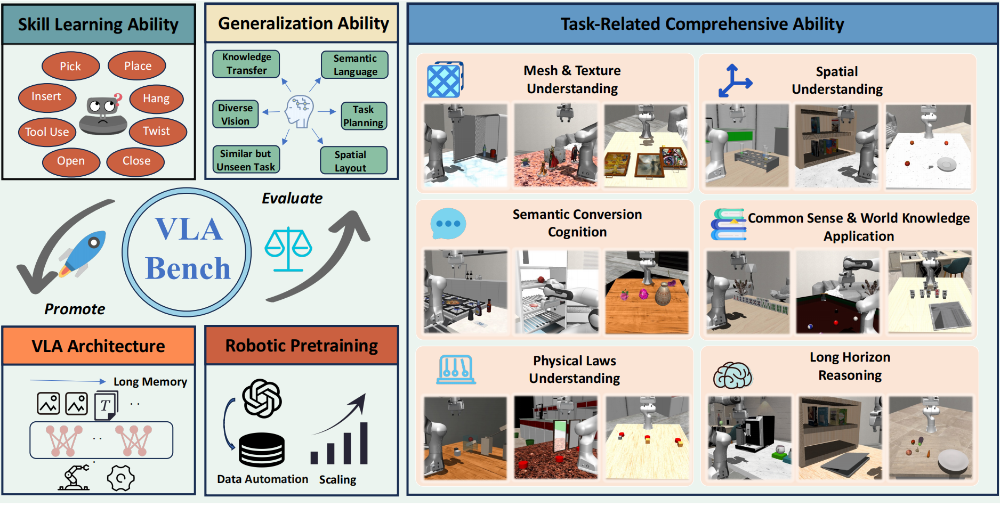

# VLABench: A Large-Scale Benchmark for Language-Conditioned Robotics Manipulation with Long-Horizon Reasoning Tasks

###  🎓 [**Paper**](docs/pdf/paper.pdf) |  🌐 [**Project Website**](https://vlabench.github.io/) ｜ 🤗 [**Hugging Face**](https://huggingface.co/VLABench) | 🐳 [**Quick Start with Docker**](./QuickStart.md)


<span style="font-size:16px"> 🚨 <span style="color:#AB4459;">**NOTICE:**</span>Please feel free to start an issue or create a PR! If I do not respond to issues in a timely manner, feel free to send me an email directly. I will do my best to build a more user-friendly community ecosystem for VLABench within this year.</span>

## News
* **Preview** A complete infra framework will be open-sourced alongside new work, including full training pipelines, VLABench evaluation, a new leaderboard, data processing, and real-device deployment. Stay tuned!  
* **2025/8/06** Update VLABench with: 
    - parrallel data collection; 
    - parrallel evaluation example; 
    - camera augmentation; 
    - rlds/lerobot data format ft dataset on [hf](https://huggingface.co/VLABench); 
    - update on [pi0 codebase](https://github.com/Shiduo-zh/openpi).
* **2025/6/26** VLABench has been accepted by ICCV 2025.
* **2025/4/10** Releasing the finetuned pi0 checkpoint(pi0-base and pi0-fast) on [hf](https://huggingface.co/VLABench).
* **2025/3/25** Releasing standard evaluation episodes and primitive task finetune dataset.
* **2025/2/26** Releasing referenced evaluation pipeline. 
* **2025/2/14** Releasing the scripts for trajectory generation. 
* **2024/12/25** The preview verison of VLABench has been released! The preview version showcases most of the designed tasks and structure, but the functionalities are still being managed and tested.

## Recent Work Todo
- [x] Organize the functional code sections. 
    - [x] Reconstruct the efficient, user-friendly, and comprehensive evaluation framework. 
    - [x] Manage the automatic data workflow for existing tasks.
    - [x] Improve the DSL of skill libarary.
- [x] Release the trejectory and evaluation scripts.
- [x] Test the interface of humanoid and dual-arm manipulation.
- [x] Release the left few tasks not released in preview version.
- [ ] Leaderboard of VLAs and VLMs in the standard evaluation 
    - [x] Release standard evaluation datasets/episodes, in different dimension and difficulty level.
    - [x] Release standard finetune dataset.
    - [ ] Integrate the commonly used VLA models for facilitate replication. (Continously update)
- [] Releasing more datasets, including pretraining version, composite tasks once finalizing testing.
- [] Releasing more checkpoints.
- [] Update the complete training and evaluation community. 

## Installation

### Install VLABench
1. Prepare conda environment
```sh
conda create -n vlabench python=3.10
conda activate vlabench

git clone https://github.com/OpenMOSS/VLABench.git
cd VLABench
pip install -r requirements.txt
pip install -e .
```
2. Download the assets
```sh
python scripts/download_assets.py
```

3. (Option) Initialize submodules
```sh
git submodule update --init --recursive
```
This will update other policies repos such openpi.

The script will automatically download the necessary assets and unzip them into the correct directory.

## Data Collection
### Run scripts to generate hdf5 dataset with multi-processing
We provide a brief tutorial in `tutorials/2.auto_trajectory_generate.ipynb` and the whole codes are in `scripts/trajectory_generation.py`. Trajectory generation can be sped up several times by using multiple processes. A naive way to use it is: 
```sh
sh dataset_generation.sh
```
Currently, the version does not support multi-processing environment within the code. We will optimize the collection efficiency as much as possible in future updates. After running the script, each trajectory will be stored as a hdf5 file in the directory you specify.

To run the parrallel data collection on distributed machines, such as 8 GPU, please refer to
```sh
bash sh/data_generation/multi_gpu_data_generation.sh
```

### Convert to rlds format
Due to some frameworks such as [Octo](https://github.com/octo-models/octo) and [Openvla](https://github.com/openvla/openvla) using data in the RLDS format for training, we refer to the process from [rlds_dataset_builder](https://github.com/kpertsch/rlds_dataset_builder) to provide an example of converting the aforementioned HDF5 dataset into RLDS format data.
First, run 
```sh
python scripts/convert_to_rlds.py --task [list] --save_dir /your/path/to/dataset
```
This will create a python file including the task rlds-builder in the directory.
Then
```sh
cd /your/path/to/dataset/task

tfds build
```
This process consumes a long time with only single process, and we are testing multithreading mthod yet. The codes of original repo seem to have some bugs. 

### Convert to Lerobot format
Following the Libero dataset process way of [openpi](https://github.com/Physical-Intelligence/openpi), we offer a simple way to convert hdf5 data files into lerobot format.
Run the script by 
```sh
python scripts/convert_to_lerobot.py --dataset-name [your-dataset-name] --dataset-path /your/path/to/dataset --max-files 100
```
The processed Lerobot dataset will be stored defaultly in your `HF_HOME/lerobot/dataset-name`.

## Expandation 
VLABench adopts a flexible modular framework for task construction, offering high adaptability. You can follow the process outlined in [tutorial 6](tutorials/6.expandation.ipynb).
<!-- ### Register New Entity
1. Process the obj file with `obj2mjcf`(https://github.com/kevinzakka/obj2mjcf). Here is an use demo, `obj2mjcf --verbose --obj-dir your_own_obj_dir --compile-model --save-mjcf --decompose`
2. Put the processed xml files/directory to somewhere under VLABench/assets/meshes.
3. If it's a new class of entity, please register a entity class in VLABench/tasks/components with global register. Then, import the class in the `VLABench/tasks/components/__init__.py`.
4. Register it in `VLABench/configs/constant.py` for global access.

### Register New Task
1. Create new task class file under `VLABench/tasks/hierarchical_tasks`. And register it with global register in `VLABench/utils/register.py`. Notice that if the current condition can not met your requirement, you should write a single Condition class in `VLABench/tasks/condition.py`.
2. Import the new task class in `VLABench/tasks/hierarchical_tasks/__init__.py`. -->

## Evaluate
VLABench currently provides standard benchmark datasets, focusing on generalization across multiple dimensions. In the [VLABench/configs/evaluation/tracks](./VLABench/configs/evaluation/tracks) directory, we have set up multiple benchmark sets across different dimensions. These configs ensure that different models can be fairly compared under the same episodes on different machines.

| Track | Description |
|----------|----------|
| track_1_in_distribution | Evaluation of the policy's task learning ability, requiring it to fit in-domain episodes with a small and diverse set of data. |
| track_2_cross_categroy | Evaluation of the policy's generalization ability at the object **category level** & **instance level**, requiring visual generalization capability. |
| track_3_common_sense | Evaluation of the policy's application of common sense, requiring the use of common sense understanding for describing the target. |
| track_4_semantic_instruction | Evaluation of the policy's ability to understand complex semantics involves instructions that are rich in contextual or semantic information. |
| track_5_cross_task | Evaluation of the policy's ability to transfer skills across tasks is **kept open** in this setting, allowing users to choose training tasks and evaluation tasks according to their needs. |
| track_6_unseen_texture | Evaluation of the policy's visual robustness, involving episodes with different backgrounds and table textures in this setting. |

**NOTICE:** The evaluation can also be done by directly sampling episodes from the environment. This evaluation method is more flexible, but there is a risk of improperly initialized episodes. We recommend using the 'evaluation_tracks' method for evaluation.

### VLA/policy evaluation
We provide a standardized fine-tuning dataset, which can be downloaded from [hf-dataset](https://huggingface.co/datasets/VLABench/vlabench_primitive_ft_dataset). In this version, the data focuses on primitive tasks. We selected 10 basic tasks and provided 500 samples for each task.

Since the current version of VLA does not perform well on primitive tasks, we plan to focus on enhancing VLA’s capabilities in this area first. In the future, we will release a more organized dataset for more composite tasks.

**1. Evaluate OpenVLA**

Before evaluate your finetuned OpenVLA, please compute the norm_stat on your dataset and place it to `VLABench/configs/model/openvla_config.json`

Run the evaluation scripts by
```sh
python scirpts/evaluate_policy.py --n-sample 20 --model openvla --model_ckpt xx --lora_ckpt xx --eval_track track_1_in_distribution --tasks task1, task2 ...
```

**Multi-GPU Accelerated Evaluation**

To speed up the evaluation process, VLABench supports multi-GPU parallel evaluation.

Example command:
```sh
bash sh/evaluation/example_multi_gpu_eval.sh 
```

You can specify which tracks and tasks to evaluate by passing the --track and --task arguments, for example:
```sh
bash sh/evaluation/example_multi_gpu_eval.sh --track track_1_in_distribution --task select_toy
```
- If these parameters are not set, the program will evaluate all tracks and tasks by default.
- Evaluation of each task in a single process typically takes around 30 minutes to 1 hour.

**2. Evaluate Openpi**

Please use `git submodule update --init --recursive` to ensure that you have correctly installed the repositories for the other models.

For openpi, you should create a virtual env with `uv` and run the server policy. Then, you can evaluate the finetuned openpi on VLABench. Please refer [here](third_party/openpi/examples/vlabench/README.md) for example.

3. Continously integrate more policies...

### VLM evaluation

Step 1. Download the evaluation episodes from HuggingFace
```sh
cd /root/of/VLABench
mkdir dataset
cd dataset

git clone https://huggingface.co/datasets/VLABench/vlm_evaluation_v1.0
```

Step 2. Evaluation VLMs
```sh
python scripts/evaluate_vlm.py --vlm_name Qwen2_VL --few-shot-num 1 --with-cot
```

Currently, the repo supports serval VLM choices:["GPT_4v", "Qwen2_VL", "InternVL2", "MiniCPM_V2_6", "GLM4v", "Llava_NeXT"], and more VLMs (diffrent family and size) will be added.

If you're evaluating GPT series, please set `OPENAI_API_KEY` and `OPENAI_BASE_URL` in your environment variables.

## Issues
When you encounter an issue, you can first refer to the [document](./docs/issues.md). Feel free to open a new issue if needed.

## Citation
```bibtex
@misc{zhang2024vlabench,
      title={VLABench: A Large-Scale Benchmark for Language-Conditioned Robotics Manipulation with Long-Horizon Reasoning Tasks}, 
      author={Shiduo Zhang and Zhe Xu and Peiju Liu and Xiaopeng Yu and Yuan Li and Qinghui Gao and Zhaoye Fei and Zhangyue Yin and Zuxuan Wu and Yu-Gang Jiang and Xipeng Qiu},
      year={2024},
      eprint={2412.18194},
      archivePrefix={arXiv},
      primaryClass={cs.RO},
      url={https://arxiv.org/abs/2412.18194}, 
}
```
