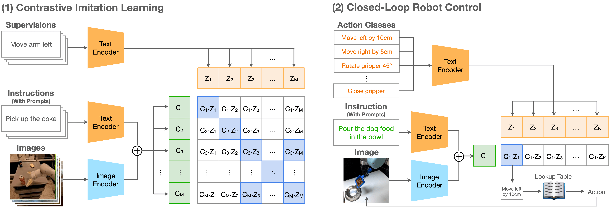

<h1>CLIP-RT</h1>

<p align="left">
  <!-- arXiv badge with working link -->
  <a href="https://arxiv.org/abs/2411.00508">
    
  </a>

  <!-- Project Page -->
  <a href="https://clip-rt.github.io/">
    
  </a>

  <!-- Project Page -->
  <a href="https://huggingface.co/clip-rt">
    
  </a>

  <!-- Citations (internal anchor) -->
  <a href="#citing">
    
  </a>
  
</p>

## 🚀 TL;DR

CLIP-RT (CLIP-based Robotics Transformer) is a vision-language-action (VLA) model for generalist manipulation policies. In real-world evaluations, CLIP-RT outperforms OpenVLA (7B parameters) by 24% in average success rates, while using 7x fewer parameters (1B). In LIBERO simulation benchmark, CLIP-RT achieves a 93.1% average success rate with an inference throughput of 163Hz. 


## Overview of CLIP-RT

   

CLIP-RT seamlessly extend OpenAI's [CLIP](https://arxiv.org/abs/2103.00020) to robot learning. It is based on the contrastive objective of CLIP, which we call contrastive imitation learning. CLIP-RT learns to predict the robotic action specified in natural language, given an image and natural language instruction. At test time, CLIP-RT selects the language-based motion in a predefined set of motion primitives.


## Quick Start

First, please install all packages and dependencies by running an all-in-one script. 
```
git clone https://github.com/clip-rt/clip-rt.git
cd clip-rt
./scripts/install.sh
```


### Usage

```python
import json
import torch
import open_clip
import numpy as np
from PIL import Image

model_name = 'ViT-H-14-378-quickgelu' # open_clip.list_pretrained() shows a list of CLIP models with different configurations
model_path = 'clip-rt-finetuned.pt'
prompt = "what motion should the robot arm perform to complete the instruction '{}'?"
lookup_table = json.load(open("docs/language_to_action.json"))
action_classes = list(lookup_table.keys()) # ["lower arm by 5cm", "rotate the gripper..."]

model, _, preprocess = open_clip.create_model_and_transforms(model_name=model_name, pretrained=model_path)
model.eval()  # model in train mode by default, impacts some models with BatchNorm or stochastic depth active
tokenizer = open_clip.get_tokenizer(model_name)

image = preprocess(Image.open("docs/example.png")).unsqueeze(0)
inst = tokenizer(prompt.format("close the laptop"))
actions = tokenizer(action_classes)

with torch.no_grad(), torch.cuda.amp.autocast():
    image_features = model.encode_image(image)
    inst_features = model.encode_text(inst)
    context_features = image_features + inst_features
    action_features = model.encode_text(actions)

    context_features /= context_features.norm(dim=-1, keepdim=True)
    action_features /= action_features.norm(dim=-1, keepdim=True)
    action_probs = (context_features @ action_features.T).sigmoid() # [.92, .01, ...]

pred = np.argmax(action_probs.squeeze(0).numpy())
pred = action_classes[pred] # language action
pred = lookup_table[pred]   # low-level action 
```


## Pretrained Checkpoints

We provide six pretrained models as:

| Model | Train Data | Link |
|:-------:|:---------:|:------:|
|CLIP-RT (pretrained) | Open X-Embodiment (OXE) Data |[Download](https://huggingface.co/clip-rt/clip-rt-oxe-pretrained)|
|CLIP-RT (fine-tuned)| OXE (pretrained) + LIBERO-10 (fine-tuned) | [Download](https://huggingface.co/clip-rt/clip-rt-finetuned-libero-10)|
|CLIP-RT (fine-tuned)| OXE (pretrained) + LIBERO-Object (fine-tuned) | [Download](https://huggingface.co/clip-rt/clip-rt-finetuned-libero-object)|
|CLIP-RT (fine-tuned)| OXE (pretrained) + LIBERO-Spatial (fine-tuned) | [Download](https://huggingface.co/clip-rt/clip-rt-finetuned-libero-spatial)|
|CLIP-RT (fine-tuned)| OXE (pretrained) + LIBERO-Goal (fine-tuned) | [Download](https://huggingface.co/clip-rt/clip-rt-finetuned-libero-goal)|


## Pretraining

Check the [pretrain directory](./pretrain/) for pretraining CLIP-RT models on the [OXE dataset](https://robotics-transformer-x.github.io)


## Fine-tuning (LIBERO)

Check the [libero directory](./libero/) to identify how we adapt CLIP-RT to the [LIBERO simulation benchmark](https://libero-project.github.io/datasets)


## Fine-tuning (Real-World)

Check the [finetune directory](./finetune/) for fine-tuning on robot data collected through language-based teleoperation 


## Acknowledgements

We use [OpenCLIP](https://github.com/mlfoundations/open_clip) for model implementation and [OpenVLA](https://github.com/openvla/openvla) for data preprocessing. Thanks!  


## Citing

If you found this repository useful, please consider citing:
```bibtex

@article{kang2024cliprt,
  title={CLIP-RT: Learning Language-Conditioned Robotic Policies from Natural Language Supervision},
  author={Kang, Gi-Cheon and Kim, Junghyun and Shim, Kyuhwan and Lee, Jun Ki and Zhang, Byoung-Tak},
  journal={arXiv preprint arXiv:2411.00508},
  year={2024}
}
```

