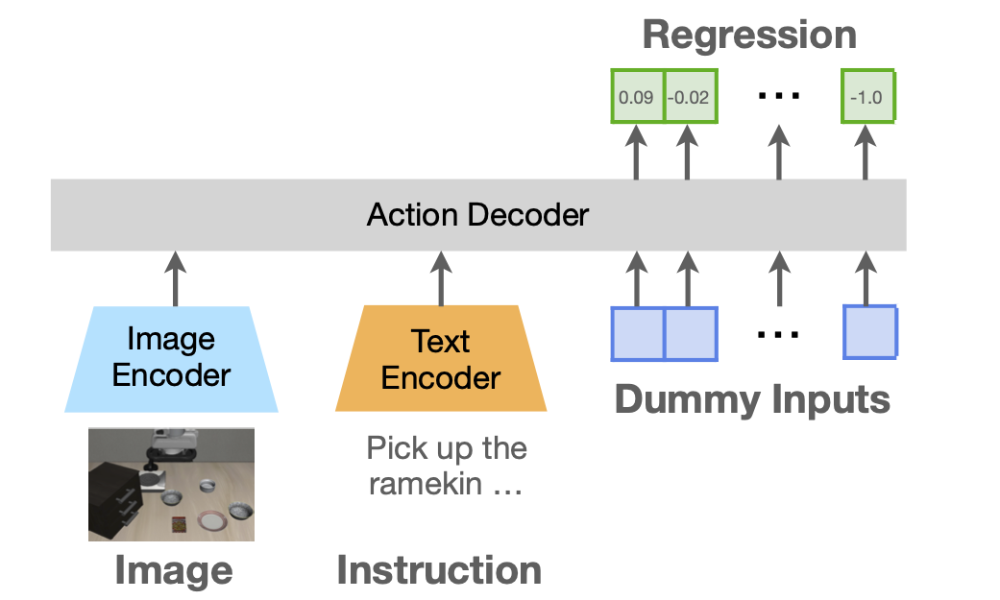
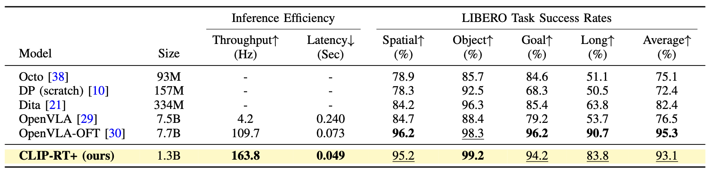

# LIBERO Experiments


This directory describes how to finetune CLIP-RT on LIBERO Datasets and evaluate the finetuned CLIP-RT models. 


## Table of Contents

* [Overview](#Overview)
* [Preprocessing](#Preprocessing-LIBERO-Datasets)
* [Finetuning](#Finetuning-on-LIBERO-Datasets)
* [Evaluation](#Evaluation)


## Overview

In LIBERO simulation benchmark, we add a 300M-parameter action decoder to the original CLIP-RT model to predict continuous actions, which we call CLIP-RT+. CLIP-RT+ uses the original CLIP model as **encoders** in this simulated setting. CLIP-RT+ learns to predict a sequence of action chunks (size 8) using [L1 regression loss and parallel decoding technique](https://github.com/moojink/openvla-oft). As a result, CLIP-RT achieves a **93.1% average success rate** on the LIBERO benchmark with an **inference throughput of 163 Hz**.
<p align="center">
  
</p>



## Preprocessing LIBERO Datasets

We adapted CLIP-RT to four LIBERO task suites: `spatial`, `object`, `goal`, and `10`. By following the [prior work](https://github.com/moojink/openvla-oft), we modified the original LIBERO datasets: (1) image resolution from 128x128 to 256x256 and (2) filter out zero-valued actions.    


The data preprocessing consists of three steps:

1. Download the [modified version of LIBERO datasets](https://huggingface.co/datasets/clip-rt/modified_libero_hdf5).
2. Convert the downloaded hdf5 data to raw data. Example script: 
```bash
python hdf5_to_raw.py --source ./libero_object_no_noops --target ./libero_object_raw
```
3. Preprocess the raw data to tar files for training. Example script: 
```bash
python preprocess.py --source ./libero_object_raw --target ./libero_object_tar --dname object #[ spatial | object | goal | 10 ]
```


## Finetuning on LIBERO Datasets

Finetuning CLIP-RT+ requires two steps:

1. Download the [OXE-pretrained checkpoints of CLIP-RT](https://huggingface.co/clip-rt/clip-rt-oxe-pretrained).
2. Run the command below. You may change the path of preprocessed tar files and the pretrained checkpoint. Furthermore, please make sure `--use-action-decoder` option is specified in the script.
```bash
cd ..
./scripts/libero.sh
```


## Evaluation

After training, you can evaluate CLIP-RT on one of the LIBERO task suites using the following command:
You can evaluate CLIP-RT on the LIBERO task suites using the following command:
```bash
python run_libero_eval_clip_rt_reg.py \
  --model_family clip_rt \
  --pretrained_checkpoint <CHECKPOINT_PATH> \
  --task_suite_name [ libero_spatial | libero_object | libero_goal | libero_10 | libero_90 ]
```
Please replace `<CHECKPOINT_PATH>` with the path to your finetuned model.


If you have any questions or issues, feel free to open the github issues or send e-mail to Gi-Cheon (chonkang@snu.ac.kr).

